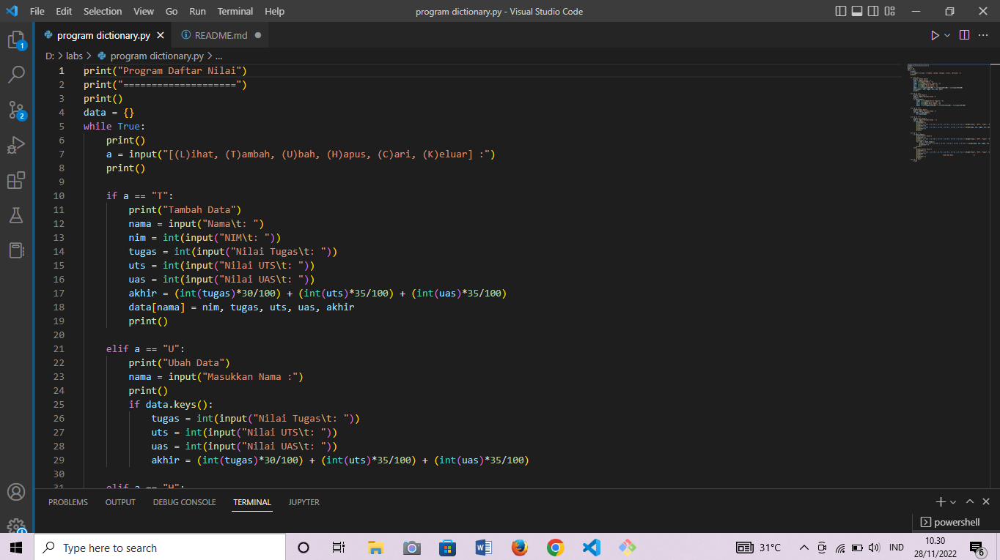
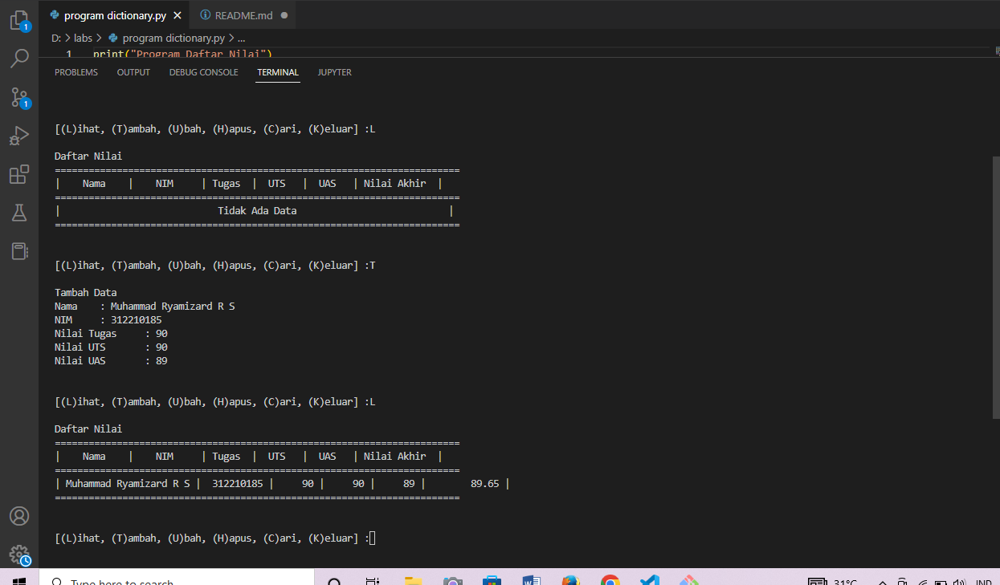

# Proses / Langkah-Langkah Praktikum 6
## Membuat dictionary dari daftar kontak

## Daftar nilai siswa menggunakan dictionary

 Membuat dictionary kosong yang nanti akan diinput dengan sebuah data.
 Membuat perulangan dengan while dan terdapat pilihan menu untuk menjalankan program.
 Menambahkan data nama, nim, tugas, uts dan uas. Data yang diinputkan akan masuk kedalam dictionary data dengan nama sebagai *keys_. sedangkan sisanya sebagai *values_.
 Menginputkan "L" maka secara otomatis sistem akan menampilkan semuanya. jika belum maka akan keluar tampilan "Tidak Ada Data".
 Menginputkan "U" apabila ingin mengubah data, maka anda akan diminta untuk menginputkan Nama terlebih dahulu. Setelah itu input data yang ingin diubah.
 Menginputkan "H" maka akan dimintai untuk menginputkan nama yang akan dihapus. Lalu data yang telah diinputkan akan dihapus beserta _values_nya.
 Menginputkan "C" apabila ingin mencari data. anda akan akan diminta menginputkan nama.
 Jika data sudah selesai diinput, pilih menu "K" maka program akan berhenti.

 OUTPUT 

### Flowchart Program

